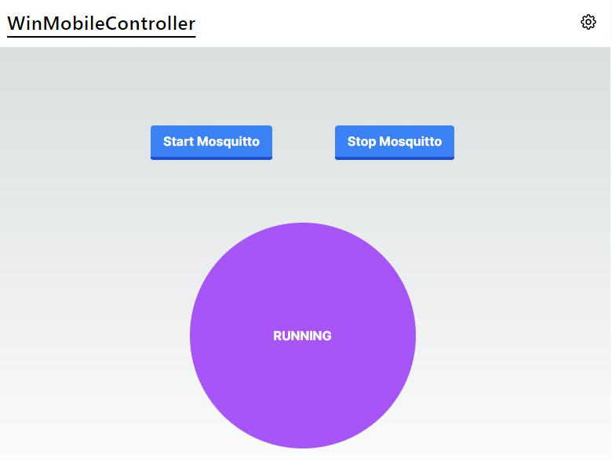
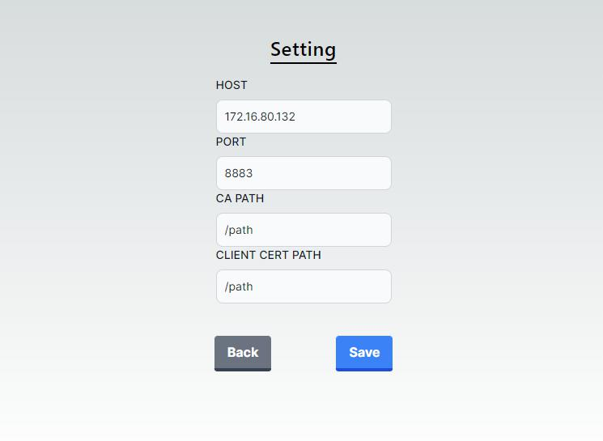
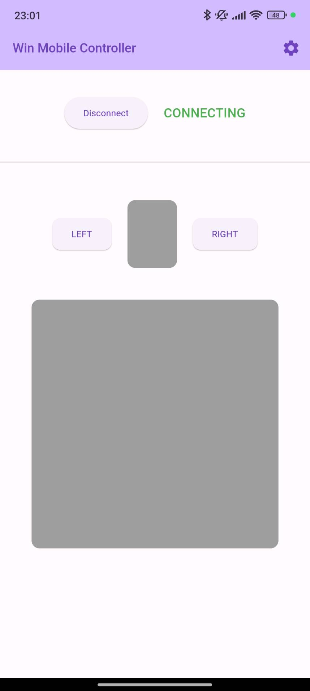
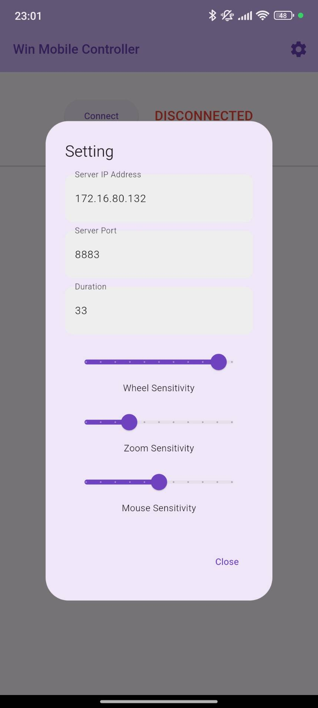

<div align="center">
    
</div>

# WinMobileController

WinMobileControllerは、Windows端末をモバイル端末からマウス操作するためのアプリケーションです。

<div style="display: flex; flex-wrap: wrap; justify-content: center;">
    
    
    
    
</div>

## システム設計


## セットアップ

### ソースコードのクローン
1. 本リポジトリをクローンしてください。

### Mosquittoのインストール
1. [Mosquittoのダウンロードページ](https://mosquitto.org/download/)からインストールしてください。

### OpenSSLのインストール
1. [OpenSSLのダウンロードページ](https://slproweb.com/products/Win32OpenSSL.html)からインストールしてください。
2. 以下のパスを設定してください。
   ```
   set OPENSSL_DIR=C:\OpenSSL-Win64
   ```
   ※インストールされるパスが異なる場合は適宜変更してください。

### TLS対応

#### 自己認証局の設定
1. `./pem/ca`フォルダ内で以下のコマンドを実行し、秘密鍵とCA証明書を生成します。
   ```
   openssl genrsa -des3 -out ca.key
   openssl req -new -x509 -days 1826 -key ca.key -out ca.crt
   ```

#### サーバ証明書の設定
1. `./pem/server`フォルダ内で以下のコマンドを実行し、秘密鍵とサーバ証明書を生成します。
   ```
   openssl genrsa -out server.key 2048
   openssl req -x509 -newkey rsa:2048 -keyout server.key -out server.crt -days 1826 -addext "subjectAltName = IP:<ブローカのIPを指定>" -CA ../ca/ca.crt -CAkey ../ca/ca.key -nodes
   ```

#### クライアント証明書の設定
1. `./pem/win-client`および`./pem/mob-client`フォルダ内で以下のコマンドを実行し、クライアント証明書を生成します。
   ```
   openssl genrsa -out <winまたはmob>-client.key 2048
   openssl req -x509 -newkey rsa:2048 -keyout <winまたはmob>-client.key -out <winまたはmob>-client.crt -days 1826 -CA ../ca/ca.crt -CAkey ../ca/ca.key -nodes
   cat <winまたはmob>-client.key <winまたはmob>-client.crt > <winまたはmob>-client.pem
   ```

#### 証明書の配置
- **Mosquitto**: `C:\Program Files\mosquitto\certs`に`server.crt`、`server.key`、`ca.crt`を配置します。
- **Flutter**: `view/assets`に`ca.crt`、`mob-client.crt`、`mob-client.key`を配置します。

#### Mosquitto設定変更
1. `C:\Program Files\mosquitto\mosquitto.conf`を編集し、以下の設定を追加します。
   ```
   listener 8883
   cafile C:/Program Files/mosquitto/certs/ca.crt
   keyfile C:/Program Files/mosquitto/certs/server.key
   certfile C:/Program Files/mosquitto/certs/server.crt
   require_certificate true
   use_identity_as_username true
   ```

### ファイアウォール設定
- ポート番号に対してインバウンドTCPの許可を設定します。

## ビルド

### Flutter
1. 以下のコマンドでAPKファイルを生成します。
   ```
   flutter build apk
   ```
2. USB接続して以下のコマンドでインストールします。
   ```
   flutter install build\app\outputs\flutter-apk\app-release.apk
   ```

### Tauri
1. 以下のコマンドでMSIファイルを生成します。
   ```
   cargo tauri build
   ```
2. 生成したMSIファイルを使用してインストールします。

## 管理者権限付与
- インストールしたTauri製のWindowsアプリのプロパティから常に管理者権限で実行するように設定します。

## アプリの起動

### Windowsサイド起動
- ビルド済みのEXEファイルを実行します。セットアップで管理者権限を付与しているため、自動的に管理者実行になります。

### モバイルサイド起動
- モバイル端末にインストールしたアプリを実行します。

## 作者
- Kano