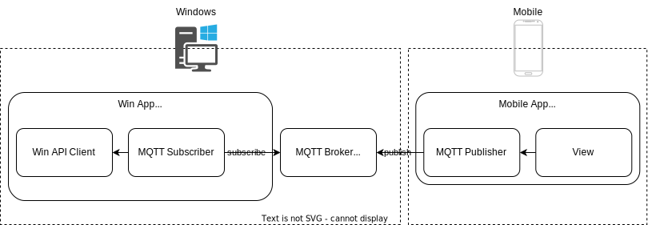

# WinMobileController

windows端末をモバイル端末からマウスキーボード操作するためのアプリケーション
# SystemDesign

# Setup
## ソースコードのクローン
* 本リポジトリをCloneしてください。
## Mosquittoのインストール
* 以下のリンクよりMosquittoをインストールしてください。
https://mosquitto.org/download/

## TLS対応
*

## ビルド
*

## 管理者権限付与
*
# Start App
## バッチの実行
* bat/start_mosquitto.bat　を管理者権限で実行する。

## Windowsサイド起動
* ビルド済みのexeファイルを実行する。Setupで管理者権限を付与しているので自動的に管理者実行になる。

## Mobileサイド起動
* モバイル端末にインストールしたアプリを実行する。
# Auther
* Kano
